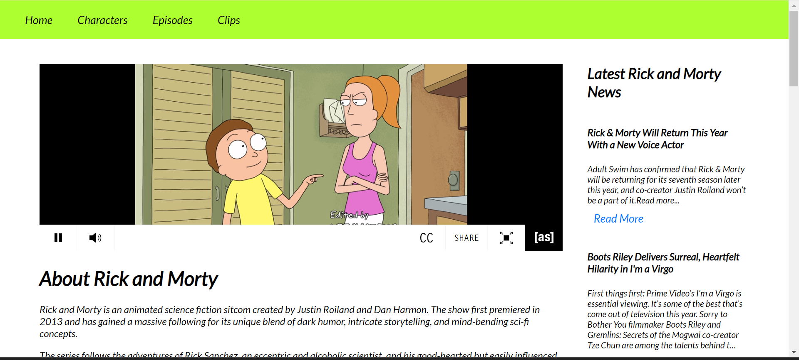
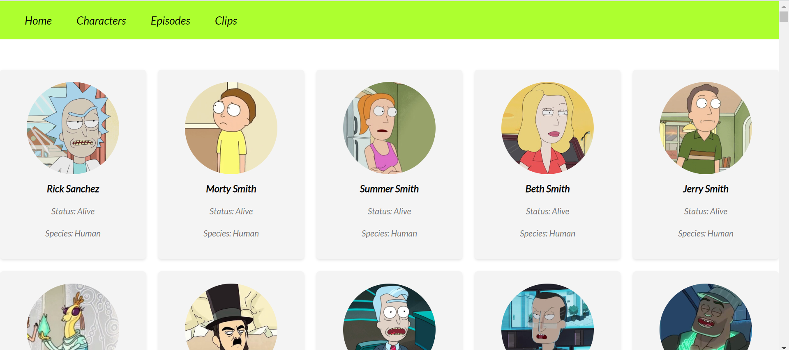

# Rick and Morty Fandom Website

Welcome to the Rick and Morty Fandom Website! This website is built using React.js and provides a platform for fans to watch a 24/7 live stream of the show, get the latest news updates, and explore information about episodes and characters.

## Features

- Live Stream: Watch the Rick and Morty show live 24/7. Enjoy your favorite episodes anytime, anywhere.
- News Updates: Stay up-to-date with the latest news about the show. Get the inside scoop on new episodes, cast interviews, and more.
- Episode Guide: Browse through a comprehensive guide of all the episodes from different seasons. Explore episode summaries, air dates, and more.
- Character Information: Dive into the world of Rick and Morty's characters. Get detailed information about each character, including their background, personality traits, and notable appearances.

## APIs Used

- [Rick and Morty API](https://rickandmortyapi.com/): Utilize the API to fetch data about episodes, characters, locations, and more.
- [NewsAPI](https://newsapi.org/): Access the NewsAPI to retrieve the latest news articles related to Rick and Morty.

## Installation

1. Clone the repository: `git clone https://github.com/your-username/your-repo.git`
2. Navigate to the project directory: `cd rick-and-morty-fandom-website`
3. Install the dependencies: `npm install`
4. Start the development server: `npm start`
5. Open the website in your browser at `http://localhost:3000`

## Contributing

Contributions are welcome! If you have any ideas, improvements, or bug fixes, please submit a pull request. Ensure that your code adheres to the project's coding guidelines.

## License

This project is licensed under the [MIT License](LICENSE).

## note

The news api key should be generated by the user and to be given in app.js . you can find your news api key in [news api](https://newsapi.org) 

